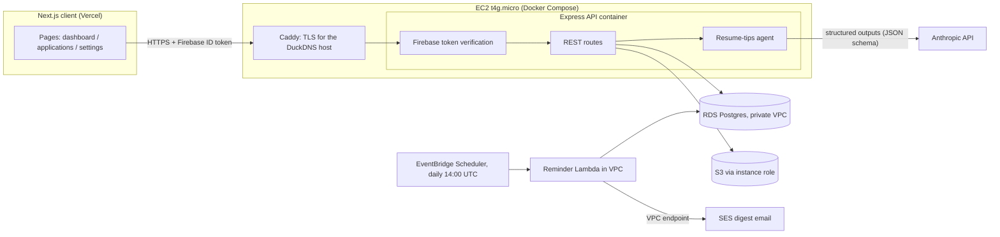

# Job Application Tracker

A full-stack job application tracker with an AI career-coach built in. Save the jobs you're applying to, track each application through its pipeline (applied → phone screen → interview → offer), schedule follow-ups, and get **Claude-generated resume tips tailored to each specific posting** — what to study, what's missing from your resume, and which bullet points to rewrite.

Try out the project: https://jobstrackeragent.vercel.app/

## Features

- **Application pipeline** — track every job by status, applied date, and notes, grouped by stage.
- **Job entry with smart inputs** — Google Places autocomplete for locations, company-name autocomplete, multi-location postings, salary and description capture.
- **Follow-up reminders** — per-application follow-up checklist, surfaced on the dashboard.
- **Daily reminder emails** — a scheduled Lambda emails each user a morning digest of upcoming follow-ups (mentioned daily from 3 days before the due date through the day itself) and applications still waiting to be submitted (nudged daily until applied).
- **Resume storage** — PDF upload to S3, automatically converted to Markdown for AI consumption.
- **AI resume tips** — one click on any application runs a Claude agent over your full resume and the posting's details, returning a structured analysis: overall fit summary, technologies to study (ranked, with reasons), gaps in the resume, concrete bullet-point rewrites, strengths to highlight, and interview-prep tips. Results are saved, and a re-run is only allowed once your resume or the posting has actually changed.

## Architecture



**Stack:** Next.js 15 / React 19 / Tailwind · Express + TypeScript · Prisma + PostgreSQL (AWS RDS) · Firebase Auth · AWS S3 · Anthropic Claude (structured outputs) · Vitest + Supertest · Docker + ECR · EC2 + Caddy · Lambda + EventBridge + SES · GitHub Actions (CI + OIDC deploys)

## Design notes

A few decisions worth calling out:

- **Per-user job postings.** Postings are scoped to the user who entered them (`@@unique([userId, jobUrl])`), so no user can rewrite what another user sees for the same URL. The migration that introduced this preserves existing data: each posting is assigned to its earliest applicant, and any other user tracking the same posting gets their own copy with their application repointed to it ([migration](server/prisma/migrations/20260706040254_job_posting_per_user/migration.sql)).
- **Staleness-gated AI runs.** Each saved analysis records the resume version it used and a SHA-256 fingerprint of the posting's content fields. While both are unchanged, the server refuses to regenerate (HTTP 409) and the UI disables the button — no way to burn tokens re-running an identical analysis. Uploading a new resume or editing the posting re-enables it.
- **PDF → Markdown at upload time.** Resumes are converted once when uploaded and both artifacts stored in S3; the agent reads the Markdown, keeping analysis requests fast and cheap.
- **Defense on the write path.** URL validation rejects non-http(s) schemes (stored-XSS vector, since posting URLs render as links), uploads are capped at 10 MB in memory, and every route checks row ownership against the authenticated user.

## Getting started

Prerequisites: Node 22+, a PostgreSQL database, a Firebase project, an S3 bucket, and an Anthropic API key.

```bash
# 1. Server
cd server
cp .env.example .env        # fill in DATABASE_URL, Firebase Admin, AWS, ANTHROPIC_API_KEY
npm install
npx prisma migrate deploy   # apply migrations
npm run dev                 # http://localhost:5000

# 2. Client (separate terminal)
cd client
cp .env.example .env.local  # fill in Firebase Web SDK config (+ optional Google Maps key)
npm install
npm run dev                 # http://localhost:3000
```

## Testing

Server tests cover the highest-value logic — the posting-content fingerprint that gates AI re-runs, input validation on the jobs route (including the XSS-vector URL check), and the resume-tips endpoints' ownership/staleness behavior — with Prisma, S3, and the Anthropic call mocked at the module boundary.

```bash
cd server
npm test          # vitest
npx tsc --noEmit  # typecheck
```

CI runs typecheck + tests for the server and Lambda, and typecheck for the client, on every push and pull request ([workflow](.github/workflows/ci.yml)).

## Deployment

The API runs on a single EC2 instance (t4g.micro, Amazon Linux 2023) as two containers managed by Docker Compose: the Express API and a Caddy reverse proxy that terminates TLS for a DuckDNS hostname with automatic Let's Encrypt certificates. The reminder digest is a Lambda inside the same VPC, invoked daily by EventBridge Scheduler; it reads the private RDS instance directly and sends email through a SES VPC interface endpoint (the Lambda has no internet access).

Security posture worth noting:

- **RDS is not publicly accessible.** Its security group admits only the API instance and the Lambda.
- **No static AWS keys in production.** The API's S3 access comes from the EC2 instance role; GitHub Actions assumes an IAM role via OIDC (scoped to pushes on `main`); the Lambda uses its execution role for SES.
- **Secrets live in SSM Parameter Store** (SecureStrings under `/jobtracker/prod/*`), rendered to the instance's env file at deploy time — nothing secret in GitHub or in the repo.

Deploys are automatic: a push to `main` (after tests pass) builds the arm64 image, pushes it to ECR, and triggers the instance to pull, run `prisma migrate deploy`, and restart — then smoke-tests `/health` over HTTPS. The Lambda bundle deploys in a parallel job.

Provisioning is scripted end-to-end in [`infra/`](infra/README.md) (idempotent AWS CLI scripts, numbered in run order).

### Local dev against the private RDS

Your laptop can no longer reach RDS directly. For `prisma migrate dev` / `prisma studio`, open an SSH tunnel through the API instance first:

```bash
ssh -i infra/jobtracker-key.pem -N -L 15433:<rds-endpoint>:5432 ec2-user@<your-host>.duckdns.org
```

then point `DATABASE_URL` at `localhost:15433` in `server/.env`. (15433 rather
than 5433: Windows reserves swaths of low ports for Hyper-V, and 5433 falls in
an excluded range on some machines.)
