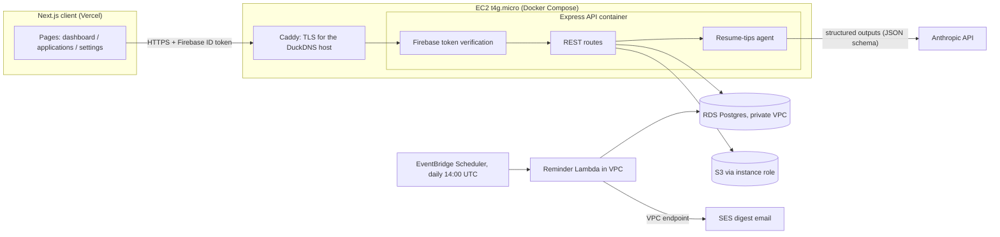

# Job Application Tracker

A full-stack job application tracker with an AI career-coach built in. Save the jobs you're applying to, track each application through its pipeline (applied → phone screen → interview → offer), schedule follow-ups, and get **Claude-generated resume tips tailored to each specific posting** — what to study, what's missing from your resume, and which bullet points to rewrite.

Try out the project: https://jobstrackeragent.vercel.app/

## Features

- **Application pipeline** — track every job by status, applied date, and notes, grouped by stage.
- **Job entry with smart inputs** — Google Places autocomplete for locations, company-name autocomplete, multi-location postings, salary and description capture.
- **Follow-up reminders** — per-application follow-up checklist, surfaced on the dashboard.
- **Daily reminder emails** — a scheduled Lambda emails each user a morning digest of upcoming follow-ups (mentioned daily from 3 days before the due date through the day itself) and applications still waiting to be submitted (nudged daily until applied).
- **Resume storage** — PDF upload to S3, automatically converted to Markdown for AI consumption.
- **AI resume tips** — one click on any application runs a Claude agent over your full resume and the posting's details, returning a structured analysis: overall fit summary, technologies to study (ranked, with reasons), gaps in the resume, concrete bullet-point rewrites, strengths to highlight, and interview-prep tips. Results are saved, and a re-run is only allowed once your resume or the posting has actually changed.
- **AI cover letter** — writes a letter for one posting from your real resume, following the conventions of your field (set in Settings): 3–4 paragraphs, 250–400 words, supporting the resume rather than repeating it, and never claiming anything the resume doesn't say. View it as it will read, edit any paragraph, copy the plain text into an application form, or download a formatted one-page PDF dated the day you download it.

## Architecture


```mermaid
flowchart LR
    subgraph Client["Next.js client (Vercel)"]
        UI[Pages: dashboard / applications / settings]
    end
    subgraph EC2["EC2 t4g.micro (Docker Compose)"]
        Caddy[Caddy: TLS for the DuckDNS host]
        subgraph Server["Express API container"]
            Auth[Firebase token verification]
            Routes[REST routes]
            Agent[Resume-tips agent]
        end
    end
    UI -- "HTTPS + Firebase ID token" --> Caddy --> Auth --> Routes
    Routes --> DB[(RDS Postgres, private VPC)]
    Routes --> S3[(S3 via instance role)]
    Agent -- "structured outputs (JSON schema)" --> Claude[Anthropic API]
    Routes --> Agent
    Sched[EventBridge Scheduler, daily 14:00 UTC] --> Lambda[Reminder Lambda in VPC]
    Lambda --> DB
    Lambda -- "VPC endpoint" --> SES[SES digest email]
```

**Stack:** Next.js 15 / React 19 / Tailwind · Express + TypeScript · Prisma + PostgreSQL (AWS RDS) · Firebase Auth · AWS S3 · Anthropic Claude (structured outputs) · Vitest + Supertest · Docker + ECR · EC2 + Caddy · Lambda + EventBridge + SES · GitHub Actions (CI + OIDC deploys)

## Design notes

A few decisions worth calling out:

- **Per-user job postings.** Postings are scoped to the user who entered them (`@@unique([userId, jobUrl])`), so no user can rewrite what another user sees for the same URL. The migration that introduced this preserves existing data: each posting is assigned to its earliest applicant, and any other user tracking the same posting gets their own copy with their application repointed to it ([migration](server/prisma/migrations/20260706040254_job_posting_per_user/migration.sql)).
- **Staleness-gated AI runs.** Each saved analysis records the resume version it used and a SHA-256 fingerprint of the posting's content fields. While both are unchanged, the server refuses to regenerate (HTTP 409) and the UI disables the button — no way to burn tokens re-running an identical analysis. Uploading a new resume or editing the posting re-enables it.
- **PDF → Markdown at upload time.** Resumes are converted once when uploaded and both artifacts stored in S3; the agent reads the Markdown, keeping analysis requests fast and cheap.
- **Defense on the write path.** URL validation rejects non-http(s) schemes (stored-XSS vector, since posting URLs render as links), uploads are capped at 10 MB in memory, hand-edited AI drafts are structurally validated before they're stored (the download endpoint renders them straight to a PDF), and every route checks row ownership against the authenticated user.
- **One account per email, recoverable either way.** Signing up with Google creates an account with no password, so a later email/password login is rejected — and Firebase can't say why without revealing which emails are registered. The reset flow doubles as the fix: it sets a password on that same uid (adding the `password` provider next to `google.com`), so the account keeps its data and both sign-in methods work afterwards. Signed-in users can do the same from Settings without the email round-trip. Reset links open Firebase's hosted handler: a custom in-app handler was built and then removed, because this project can't repoint the action URL — the API rejects any write under `notification.sendEmail` with `400 EMAIL_TEMPLATE_UPDATE_NOT_ALLOWED` (a Google-side restriction on standard templates; the domain is authorized and the project is `subtype: FIREBASE_AUTH`, so neither of the usual causes applies). One consequence to know: `PASSWORD_RULES` is a typing-time checklist, not enforcement — the hosted page and the REST API both bypass it. Enforcing it server-side needs Identity Platform's password policy, which this project isn't upgraded for.
- **Reminders are idempotent per day.** Both digest sections record when they were sent — `FollowUp.reminderSentAt` and `Application.nudgeSentAt` — and are stamped only after SES accepts that user's email. A retried invocation (the handler fails loudly when any recipient bounces) re-sends nothing that already went out, while a genuinely failed send stays queued for the next run.

## Getting started

Prerequisites: Node 22+, a PostgreSQL database, a Firebase project, an S3 bucket, and an Anthropic API key.

```bash
# 1. Server
cd server
cp .env.example .env        # fill in DATABASE_URL, Firebase Admin, AWS, ANTHROPIC_API_KEY
npm install
npx prisma migrate deploy   # apply migrations
npm run dev                 # http://localhost:5000

# 2. Client (separate terminal)
cd client
cp .env.example .env.local  # fill in Firebase Web SDK config (+ optional Google Maps key)
npm install
npm run dev                 # http://localhost:3000
```

Password reset and email verification both use Firebase's hosted action handler — no
console setup needed. See the account-linking note under [Design notes](#design-notes)
for why this project doesn't host its own.

## Testing

Server tests cover the highest-value logic — the posting-content fingerprint that gates AI re-runs, input validation on the jobs route (including the XSS-vector URL check), the structural validation that stops a malformed hand-edited draft from reaching the PDF renderer, and the resume-tips endpoints' ownership/staleness behavior — with Prisma, S3, and the Anthropic call mocked at the module boundary. Client tests cover the pure logic behind the UI: list sorting/filtering, password and auth-error mapping, the status tables, and date formatting (which is timezone-sensitive, so the suite asserts it under several zones).

```bash
cd server && npm test           # vitest
cd lambda && npm test
cd client && npm test && npm run lint
```

CI runs lint + typecheck + tests on every push and pull request ([workflow](.github/workflows/ci.yml)).

## Deployment

The API runs on a single EC2 instance (t4g.micro, Amazon Linux 2023) as two containers managed by Docker Compose: the Express API and a Caddy reverse proxy that terminates TLS for a DuckDNS hostname with automatic Let's Encrypt certificates. The reminder digest is a Lambda inside the same VPC, invoked daily by EventBridge Scheduler; it reads the private RDS instance directly and sends email through a SES VPC interface endpoint (the Lambda has no internet access).

Security posture worth noting:

- **RDS is not publicly accessible.** Its security group admits only the API instance and the Lambda.
- **No static AWS keys in production.** The API's S3 access comes from the EC2 instance role; GitHub Actions assumes an IAM role via OIDC (scoped to pushes on `main`); the Lambda uses its execution role for SES.
- **Secrets live in SSM Parameter Store** (SecureStrings under `/jobtracker/prod/*`), rendered to the instance's env file at deploy time — nothing secret in GitHub or in the repo.

Deploys are automatic: a push to `main` (after tests pass) builds the arm64 image, pushes it to ECR, and triggers the instance to pull, run `prisma migrate deploy`, and restart — then smoke-tests `/health` over HTTPS. The Lambda bundle deploys in a parallel job.

Provisioning is scripted end-to-end in [`infra/`](infra/README.md) (idempotent AWS CLI scripts, numbered in run order).

### Local database (the default)

Day-to-day development runs against a **local** PostgreSQL, never production.
Match production's major version — PostgreSQL **18** — so migrations behave the
same in both places. One-time setup:

```bash
psql -U postgres -p 5433 \
  -c "CREATE ROLE jobtracker LOGIN PASSWORD 'jobtracker_local_dev'" \
  -c "CREATE DATABASE jobtracker_dev OWNER jobtracker"

cd server && npx prisma migrate deploy
```

Two separate `-c` flags because `CREATE DATABASE` cannot run inside a
transaction block. `server/.env.example` already points `DATABASE_URL` here.

### Reaching production RDS (deliberately)

RDS is private — no public route, and the API instance has **no inbound SSH**
(port 22 is closed; `01-security-groups.sh` actively revokes any rule for it).
When you genuinely need prod, open a port-forwarding tunnel:

```bash
./infra/tunnel.sh          # localhost:15433 -> prod RDS:5432
```

Leave it running in its own terminal and point `DATABASE_URL` at
`localhost:15433` with the RDS master credentials. The script discovers the
instance and endpoint itself; `LOCAL_PORT=15444 ./infra/tunnel.sh` if 15433 is
taken.

> **This is live user data.** Prefer the local database for anything that
> writes — especially `prisma migrate dev`, which has wiped this database before.

Requires, one time:

- the [Session Manager plugin](https://docs.aws.amazon.com/systems-manager/latest/userguide/session-manager-working-with-install-plugin.html)
  installed locally (the `aws` CLI alone is not enough), and
- `ssm:StartSession` on the instance plus the
  `AWS-StartPortForwardingSessionToRemoteHost` document.

For a plain shell rather than a tunnel, EC2 → Instances → Connect → Session
Manager works in the browser with no local install.
