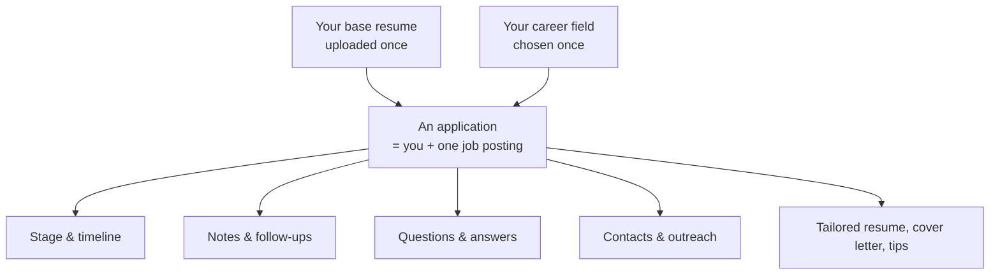
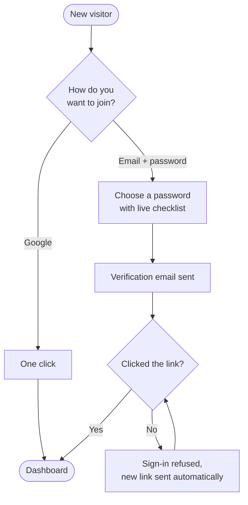

# JobTracker — Feature & Flow Guide

*A plain-English walkthrough of everything the app does, written for people who
want to understand the product rather than the code.*

---

## Contents

1. [What the app is](#1-what-the-app-is)
2. [The core idea](#2-the-core-idea)
3. [Map of the app](#3-map-of-the-app)
4. [Flow: Getting an account](#4-flow-getting-an-account)
5. [Flow: First-time setup](#5-flow-first-time-setup)
6. [Flow: Adding a job](#6-flow-adding-a-job)
7. [Flow: The applications list](#7-flow-the-applications-list)
8. [Flow: The application workspace](#8-flow-the-application-workspace)
9. [Flow: The dashboard](#9-flow-the-dashboard)
10. [Flow: The daily reminder email](#10-flow-the-daily-reminder-email)
11. [How the AI features behave](#11-how-the-ai-features-behave)
12. [Account tiers and premium access](#12-account-tiers-and-premium-access)
13. [The admin area](#13-the-admin-area)
14. [Behaviours that apply everywhere](#14-behaviours-that-apply-everywhere)
15. [A day in the life](#15-a-day-in-the-life)
16. [Glossary](#16-glossary)

---

## 1. What the app is

JobTracker is a personal job-search workspace. It does two jobs at once:

**It remembers.** Every role you're chasing lives in one list, with its stage,
the date you applied, where you found it, who you've spoken to, what happened at
each interview, and what you promised to do next.

**It writes.** You upload your resume once. From then on, for any single job in
your list, the app can produce a version of your resume aimed at that posting, a
cover letter for it, coaching on how your resume reads against it, answers to the
employer's application questions, and a short LinkedIn note to send the recruiter.

The distinction that matters: the tracking half is a filing cabinet, and the
writing half is an assistant that has read both your resume and the specific job
ad. Neither half is useful without the other — the assistant is only good because
it knows which job you mean.

### Who it's for

Someone running an active job search across many applications at once — the point
of pain being that applications tailored to each posting are far more effective
than generic ones, but tailoring by hand for forty roles is not realistic. The
app makes the tailored version the cheap option.

---

## 2. The core idea

Everything in the app hangs off one unit: **an application**. An application is
you + one specific job posting. Around that single object the app collects nine
kinds of information:

| What | Who creates it |
|---|---|
| The job's details (title, company, location, salary, description) | You, or pulled in automatically from the job link |
| Its stage in your pipeline | You |
| A history of stages it has passed through | The app logs it; you annotate it |
| Free-text notes | You |
| Follow-up dates | You |
| The employer's application questions and your answers | You, with AI help |
| People you've contacted about it | You, with AI help on the outreach note |
| A resume tailored to it | AI, editable by you |
| A cover letter for it | AI, editable by you |
| Coaching on how you match it | AI, read-only |

Delete the application and all ten go with it. Nothing is shared between
applications except your one base resume and your chosen career field.

---

## 3. Map of the app

Once signed in there are three main destinations, plus a fourth for
administrators.

**Dashboard** — the "what should I do today" screen. Counts by stage, the
follow-ups coming due, a chart of where everything sits, and one prompt telling
you the highest-value thing you could do right now.

**Applications** — the full list, grouped by stage, with search, filtering and
sorting. This is also where you add a new job.

**Application workspace** — you reach this by clicking any job in the list. It's
a single job's whole world, split across eight tabs.

**Settings** — your resume, your career field, your premium status, and your
password.

**Admin** — only visible to administrators. Manage who has premium access.

On a computer these sit in a sidebar down the left. On a phone the same
destinations appear as a tab bar pinned to the bottom of the screen, within thumb
reach, with the app name in a bar across the top.

---

## 4. Flow: Getting an account

There are two ways in, and they lead to the same place.

### Signing up with email and password

You enter an email and choose a password. As you type, a checklist under the
password box shows which requirements you've met so far, so you're not guessing.

When you submit, the app sends a verification link to your email and shows a
confirmation screen. **You cannot use the app until you click that link.** If you
try to sign in first, the app stops you, immediately sends you a fresh link, and
tells you to check your inbox — with a button to send another if it didn't
arrive.

### Signing up with Google

One button. No password, no verification email, no waiting — Google has already
confirmed the address. You land straight on the dashboard.

### The overlap problem, and how it's handled

If you signed up with Google and later try to sign in with a password, it will be
rejected — the account genuinely has no password on it. For security reasons the
app is not told *why* the sign-in failed, so it cannot say "you used Google."
Instead, whenever a sign-in is rejected, it shows both possibilities:

> If you signed up with Google, use **Continue with Google** below — or **set a
> password** for this email.

That second link is the fix. The "forgot password" flow doubles as a "set a
password" flow: run it on a Google account and you end up with an account that
works *both* ways, with all your data intact. Nothing is duplicated and nothing
is lost.

Once you're signed in, Settings has the same capability without the email round
trip — change your password, or add one, directly.

---

## 5. Flow: First-time setup

Two things in Settings unlock and shape everything else.

### Your base resume

Upload one PDF, up to 10 MB. This single file is the source for every word the AI
writes — the tailored resumes, the cover letters, the tips, the drafted answers
and the LinkedIn notes. Until you upload one, all five AI features are visibly
locked, and the app says so plainly rather than letting you click into a dead end.

Replacing it is deliberately a decision, not a slip. The app warns you first:
every document you've already generated will be marked out of date, and you'll be
able to regenerate them. Your old documents aren't deleted — they're just flagged
as having been built from a resume you no longer use.

### Your career field

A single dropdown with nine options:

General · Software Engineering · Finance & Banking · Consulting · Marketing ·
Sales · Healthcare & Nursing · Design & Creative · Data & Analytics

This is not cosmetic. It changes what the AI thinks "good" looks like — which
achievements to lead with, which keywords matter, what advice is worth giving,
and even which headings appear in your resume tips. A software engineer gets
*"Technologies to study"* and *"Systems and projects to showcase."* A nurse gets
*"Licenses and certifications to pursue"* and *"Clinical details to add."* A
consultant gets *"Engagements to reframe as case stories."*

Changing your field affects everything generated **from that point on**. Documents
you've already made keep the wording they were given; regenerate them to pick up
the new field. The app tells you this on the setting itself.

---

## 6. Flow: Adding a job

From the dashboard or the applications page, "Add application" opens a form.

### The fast path: autofill

Paste the job's web address and press **Autofill**. The app fetches the posting
and fills in the title, company, location, salary and full description for you.
It also swaps in the posting's official link in place of whatever you pasted, so
the link you keep is the clean one.

A note appears: *"Filled in from the posting — review the details before saving."*
That review step is intentional. The app is confident, not certain, and you're
the one who has to live with what gets saved.

Autofill currently understands **AshbyHQ**, **Greenhouse**, **Workday**,
**Workable** and **Work at a Startup** (Y Combinator's board) postings — between
them, most of what a job hunt turns up. Paste anything else and it says so
clearly rather than failing silently — you just fill the form in yourself.

Two things to expect from the Workday side. Its postings carry no pay field, so
salary comes back empty even when the description mentions a range, and the
company name is derived from the careers-site address (`nvidia` → "Nvidia"), so
it's worth a glance before saving. Only Workday's own `myworkdayjobs.com`
addresses work; a company that fronts Workday with its own domain doesn't.

Work at a Startup fills in more than the others, because it publishes more. When
a role lists equity it's kept alongside the pay ("$150K - $250K + 0.10% - 1.00%
equity"), and the description you get back is the role write-up plus the skills
the company tagged the role with plus its interview process, each labelled —
that last one is often the most useful part of a YC posting and it's easy to
lose track of once the link is closed. Paste the posting link itself
(`workatastartup.com/jobs/104197`); a company's page there lists several roles
at once, so it isn't a posting and autofill will say so.

### The manual path

Three fields are required — the job link, the title, and the company. Everything
else is optional but valuable:

- **Company** offers name suggestions as you type.
- **Location** takes several locations for postings listed in more than one place,
  with address suggestions as you type.
- **Salary** is free text, so "$120k–$150k" and "DOE" are both fine.
- **Where you found it** suggests the usual sources — LinkedIn, Indeed, Glassdoor,
  a company website, a referral, a recruiter, a job board, a career fair — but
  accepts anything.
- **Description** is the posting's text.

**The description deserves emphasis.** It is the single biggest lever on the
quality of everything the AI produces. The form says so at the point of entry
(*"Paste the posting text — the AI features read this"*), and if you skip it, the
job's Overview tab keeps offering to add one. Autofill captures it for you when
it can.

Saving takes you straight into that job's workspace, ready to work.

---

## 7. Flow: The applications list

Everything you're tracking, in one place.

### How it's organised

Applications are **grouped by stage**, each group with a coloured dot, a name and
a count, and each group collapsible so you can fold away the stages you don't
care about right now. The six stages, in pipeline order:

| Stage | Meaning |
|---|---|
| **Not applied** | Saved, but you haven't submitted it yet |
| **Applied** | Submitted, waiting to hear back |
| **Phone screen** | A recruiter or first-round call is happening |
| **Interview** | In the interview process proper |
| **Offer** | They made you an offer |
| **Rejected** | Closed, either way |

Each stage keeps the same colour everywhere it appears in the app — in this list,
on the dashboard tiles, in the chart, and on timeline entries — so you learn the
colours once. "Not applied" is deliberately a plain grey: it's the inactive state,
and giving it a colour would make it look like just another active stage.

### Finding things

- **Search** across companies, roles and keywords.
- **Filter** to a single stage.
- **Sort** by several orders — most recently added, applied date, and so on.

If a search finds nothing, you get a message naming what you searched for and a
one-click way to clear the filters, rather than an empty screen you have to
diagnose.

### Working directly from the list

Each row shows the company logo, the company, the role, and a line of context
(location, salary, where you found it), plus the applied or added date.

Two things you can do without opening the job:

- **Change its stage** from a dropdown right on the row.
- **Open the posting** in a new tab, or **delete** the application, from a small
  menu at the end of the row.

Deleting always asks first, and the confirmation names what else disappears:
follow-ups, questions, contacts and generated documents.

### When it's empty

A new account doesn't see an empty table. It sees an invitation: *"Paste a job
link and we'll fill in the details for you,"* with a button to add the first one.

---

## 8. Flow: The application workspace

Click any job and you get its own workspace: a header that stays put, and eight
tabs beneath it.

### The header

The facts that stay true no matter which tab you're on: the company logo and
name, the role, the location, and four fields —

- **Applied** — the date you submitted
- **Next follow-up** — the soonest open one, with how far away it is, in red if
  it's overdue. If there isn't one, this becomes a "Schedule one" link.
- **Where you found it**
- **Status** — a dropdown you can change from here

A menu in the corner offers editing the job's details, opening the original
posting, or deleting the application.

**One quiet convenience:** when you move a job off "Not applied" and there's no
applied date recorded, the app fills in today's date for you. Previously that
field sat empty on every job people advanced, because remembering to set it
separately is not something anyone does.

### The eight tabs

Tabs that hold collections show a small count, so you can see there are three
contacts without opening Contacts. Your current tab is remembered in the page
address, so a reload or a shared link comes back to the same place.

---

#### Tab 1 — Overview

The job's details and two side panels.

**Job details** shows the applied date and where you found it, both editable in
place, plus location and salary. **Edit** opens the full form to change any of the
job's information.

**Job description** shows the posting text. If it's missing, this is where the app
asks for it: *"No description saved. The AI features read this — adding it makes
every generated document sharper."*

**Application checklist** — a five-step progress bar for this one job:

1. Tailored resume built
2. Cover letter written
3. Application questions answered (shows "2 of 5 answered" while in progress)
4. Submitted (ticks once the stage moves off "Not applied")
5. Follow-up scheduled

Unfinished steps carry a hint telling you what the step means. It's a progress
indicator, never a gate — nothing is blocked by an unticked box.

**Notes** — a free-text box for anything that doesn't fit elsewhere. It saves by
itself when you click away, with a brief "Saved" confirmation.

---

#### Tab 2 — Timeline

The history of this application, stage by stage.

Entries are **logged automatically** every time you change the status. Each one
carries its stage, the date it happened, and a note you can write — what came up
on the phone screen, how the second round went, who was in the room.

You can also add entries by hand, which is how you backfill an application you
started tracking late. Any entry's date can be corrected, and any entry can be
deleted.

The result is a record you can actually use: when a recruiter calls back three
weeks later, you can see exactly what was said and when.

---

#### Tab 3 — Resume tips *(AI)*

Coaching, not a document. It reads your resume and this specific posting and tells
you how the two line up. Read-only by design — the two editable documents have
their own tabs.

What it produces:

- **A summary** of how you fit the role overall.
- **Two field-specific sections** of ranked items, each with a reason. What these
  are called depends on your career field — an engineer sees *"Technologies to
  study"* and *"Systems and projects to showcase"*; a marketer sees *"Channels
  and tools to learn"* and *"Campaigns to quantify."*
- **Missing from your resume** — what the posting asks for that your resume
  doesn't address.
- **Bullet points to add or change** — each shown as your current wording, the
  suggested rewrite, and why the change helps.
- **Strengths to highlight** — what you already have that you're underselling.
- **Other tips** — interview preparation and anything else worth knowing.

---

#### Tab 4 — Tailored resume *(AI)*

Your resume, rewritten for this posting. Same facts, different emphasis, different
order — capped at one page.

**The rule that governs it: it never invents anything.** It reorders, rephrases
and re-emphasises what's already in your resume, and nothing else. To let you
verify that, every changed bullet is displayed with the original struck through
underneath it. You can see exactly what was altered without comparing documents
side by side.

At the top, a short note explains the approach it took — what it moved forward and
why.

**What you can do with it:**

- **Edit wording** — every bullet and the summary become editable boxes. The
  letterhead (your name and contact details) stays fixed, since those come from
  your resume. Save or cancel.
- **Download PDF** — a formatted one-page document.

Editing is tracked. Once you've edited, the panel is labelled *"Edited by you,"*
and if you later ask for a regeneration the app warns that your edits will be
replaced and waits for you to confirm.

---

#### Tab 5 — Cover letter *(AI)*

A letter for this specific job, written from your real resume, following the
conventions of your field.

The constraints it works under:

- Three to four paragraphs, roughly 250–400 words — the length recruiters
  actually read. The current word count is displayed.
- It **supports** the resume rather than repeating it.
- It never claims anything your resume doesn't say.

The letter is shown as it will read: your name and contact details as a
letterhead, the addressee block (only the lines the posting actually provided),
greeting, body paragraphs, closing and signature.

**Two ways to take it away, for two different situations:**

- **Copy text** gives you just the letter body — greeting through signature. This
  is what you paste into an application form's cover-letter box, which collects
  your contact details separately.
- **Download PDF** gives you the full formatted letter with letterhead, dated the
  day you download it. This is what you attach.

**Edit wording** lets you rewrite the greeting or any paragraph. As with the
resume, edits are tracked and regenerating asks first.

---

#### Tab 6 — Questions *(AI)*

For the essay questions employers put on their application forms — *"What's
something you worked on that you're proud of?"*

You paste in each question the form asks. Under each one is an answer box you can
write in yourself, or hand to the AI in one of two ways:

- **Draft with AI** — writes a completely new answer from your resume, this
  posting and your notes.
- **Refine my draft** — takes what *you* wrote and improves it, keeping your ideas
  and your voice.

**Which button is prominent flips with the state of the box.** With nothing
written, drafting from scratch leads. The moment you have words down, refining
your own draft becomes the primary action and "new draft" steps back — because
replacing something a person wrote should never be the path of least resistance.
Asking for a fresh draft over an existing answer prompts for confirmation first.

Refining sends whatever is currently in the box, including edits you haven't saved
yet, so the AI works from what you're actually looking at.

A counter at the top tracks "3 of 5 answered," and this feeds the Overview
checklist.

---

#### Tab 7 — Contacts *(AI)*

The people attached to this application — recruiters, hiring managers, referrals.

Each contact holds a name (the only required field), position, LinkedIn profile,
email, phone, and notes (*"Met at the campus career fair — said to mention her
referral"*). Email and phone become clickable links.

**The LinkedIn outreach flow.** Each contact tracks where you stand:

**Not connected → Connection sent → Connected → Messaging**

These are shown as a deliberately different style of badge from the application
stages, so a contact's networking state can never be mistaken for an
application's stage.

Underneath sits a **connection message** — the short note you attach to a LinkedIn
connection request. The app generates one from this posting, your resume and where
the application currently stands. LinkedIn caps these notes at 300 characters, so
the app does too, with a live character count that turns red if you exceed it
while editing.

You can edit the generated note, and it saves when you click away.

---

#### Tab 8 — Follow-ups

Dates you want to chase something up, each with an optional note like "Send
thank-you email."

Every open follow-up appears on your dashboard, and the daily email reminds you
starting three days before it's due.

Each has a checkbox to mark it done — completed ones sink to the bottom of the
list and get struck through. Open ones are colour-coded by urgency:

| | |
|---|---|
| **Overdue** | Red |
| **Due today** | Amber |
| **Due soon** | Violet |
| **Later** | Grey |

Each shows both the actual date and a plain-English version ("in 3 days",
"yesterday").

---

## 9. Flow: The dashboard

The screen that answers "what should I do today?"

**A greeting** by time of day, using your first name.

**Six stage tiles** with counts. Each is clickable and drills straight into the
applications list filtered to that stage — because a count is the most obvious
place to want to click through from.

**Upcoming follow-ups** — every open follow-up across all your applications,
soonest first, showing the company, role, note and an urgency chip. It lists five
and then says "+3 more scheduled" rather than becoming a wall. Clicking any row
jumps to that application.

**Applications by status** — a donut chart of where everything sits, with every
slice labelled and counted in the legend rather than relying on colour alone.

**One prompt at the bottom.** This is the app's opinion, computed from your own
numbers, in priority order:

1. No applications yet → *"Add your first job to start tracking."*
2. Overdue follow-ups → *"You have 2 overdue follow-ups. Chasing them is the
   highest-value thing you can do today."*
3. Saved but unsubmitted jobs → *"3 saved jobs are still waiting to be submitted.
   Pick one and finish it."*
4. Offers on the table → *"2 offers on the table — nice work, Ari."*
5. Otherwise → encouragement with your submitted count.

Worth noting: **this prompt is not AI.** It's arithmetic on your own data. The app
is careful about this — the sparkle icon and the "Generated by AI" label appear
when, and only when, a model actually wrote something. This banner has neither.

---

## 10. Flow: The daily reminder email

Once a day, every user with something outstanding gets a single digest email.

**Section one — follow-ups due.** Each job, the due date, and your note. A
follow-up appears in this email on each of the three days before it's due, and
again on the day itself. That's four chances to see it before it goes overdue.

**Section two — not applied yet.** Every job still sitting in "Not applied," with
the date you saved it. These are nudged every day until you either apply or drop
them.

The subject line summarises the contents — *"Job tracker: 2 follow-ups due, 3
applications to submit"* — so it's actionable from the notification alone.

**If you have nothing outstanding, you get no email.** The app does not send
"nothing to do today" messages. And the system tracks what it has already sent, so
you can never receive the same reminder twice in one day.

---

## 11. How the AI features behave

Five features use AI: **resume tips, tailored resume, cover letter, drafted
answers, and LinkedIn connection notes.** They share a set of rules.

### Everything is built from your real resume

Not a profile you fill in, not a questionnaire — the PDF you uploaded. This is why
the resume gates all five features, and why replacing it marks previous output as
out of date.

### Generated work doesn't regenerate for free

Once a document has been generated, the button to generate it again is **disabled**
and the panel is marked *"Up to date."* Hovering the button explains why:

> Already up to date — update your resume or this posting to regenerate.

This is not a limitation, it's the point. Running the same analysis over the same
inputs produces the same answer while costing real money. The moment an input
genuinely changes — you replace your resume, or edit the job's description, title
or details — everything derived from it flips to *"Inputs changed"* and the
buttons come back to life.

The same idea governs LinkedIn notes: a note stays locked while it still reflects
the contact, the application and the posting. Edit any of those, or clear the note,
and you can draft a new one.

### The state of every panel is visible

A chip beside each panel's title always says where things stand:

| Chip | Meaning |
|---|---|
| **No resume** | Upload a resume to unlock this |
| **Not generated** | Nothing made yet |
| **Generating…** | In progress right now |
| **Up to date** | Made, and its inputs haven't changed |
| **Inputs changed** | Your resume or the posting changed since this was made |
| **Edited by you** | You've hand-edited it |

Below any generated content there's a provenance line: that a model wrote it, when,
and whether it still matches the inputs it was made from.

### Generating shows its work

Rather than a spinner, each feature shows the actual steps in order — *"Reading
your resume," "Reading this posting," "Comparing them against your field,"
"Writing your tips."* Different features list different steps, because they do
different things.

**You can leave.** Switch to another tab while something is generating and it keeps
running; come back and it's still going or already finished. Your work isn't lost
and you won't be tempted into starting a second run.

### Your edits are respected

Anywhere you can edit AI output, the app protects that edit:

- Regenerating over your edits asks for confirmation first.
- Asking for a brand-new answer over one you wrote asks first.
- Replacing a LinkedIn note you've written asks first.
- Replacing your resume warns you what it invalidates.

The consistent principle: **the app never silently overwrites something a person
wrote.**

### Nothing is fabricated

The tailored resume rephrases and reorders; it does not add. The cover letter
never claims anything your resume doesn't support. And to make that checkable
rather than a promise, changed resume bullets are always shown against their
originals.

---

## 12. Account tiers and premium access

Three tiers.

**Basic** — the default. **10 AI generations per day**, shared across all five
features. Each generation of a tailored resume, cover letter, tips set, drafted
answer or LinkedIn note counts as one.

**Premium** — unlimited AI use.

**Admin** — unlimited, plus access to the admin area.

### How you know where you stand

Basic users see a pill in the top bar at all times: **"3/10 AI calls used today."**
It's always visible, so the limit is never a surprise mid-task. Premium and Admin
users see nothing there, because they have nothing to track.

Settings restates the same number in context and explains what counts toward it.

### Fairness built into the counter

- The count resets daily.
- If a generation **fails before the AI is ever reached**, it doesn't count. You
  aren't charged for the app's problems.
- If the AI **did run** and something went wrong afterwards, it does count — the
  work was genuinely done and paid for.

### Requesting premium

Basic users can request an upgrade from Settings by writing a short message
explaining what they're using the app for (up to 2,000 characters). After
submitting, the section shows **"Your premium request is pending review"** and you
can't stack duplicate requests.

An administrator reviews it. Approval is immediate — the badge, the limit and the
pill all update.

---

## 13. The admin area

Visible only to administrators, who also get an extra "Admin" item in their
navigation. Two tabs.

### Users

Every account, as a grid of cards. Each card shows the email, the join date, a
tier badge, how many AI calls a Basic user has left today, and a flag if they have
a premium request waiting.

You can **search by email**, choose how many to show per page (10, 25, 50 or 100),
and page through the results. One button per card upgrades a Basic user to Premium
or downgrades a Premium user to Basic. Admin accounts have no such button — they
can't be changed from here.

### Requests

Pending premium requests, each showing the requester's email, when they asked, and
the full message they wrote. **Approve** or **Deny**, one click each. Searchable by
email or by message content, which matters once there's a backlog.

Approving a request upgrades that user and clears the request in one action —
there's no second step to forget. Upgrading someone from the Users tab does the
same thing to any request they had pending.

---

## 14. Behaviours that apply everywhere

Small consistencies that shape how the app feels.

**Copy buttons are everywhere.** Nearly every text field — job URL, title, salary,
notes, answers, connection messages, timeline notes — has a copy button tucked
into its corner. The app assumes you're constantly moving text into someone else's
web form, because you are.

**Text saves itself.** Notes, answers, timeline notes and connection messages save
when you click away, with a brief confirmation. There is no "save" button to
forget.

**Instant feedback, honestly handled.** Changing a stage from the list updates the
screen immediately rather than waiting for the server. If the save fails, the
change is rolled back and you're told — you're never left believing something
saved when it didn't.

**Deleting always confirms, and always says what else goes.** Not just "are you
sure" but "its follow-ups, questions, contacts and generated documents go with it.
This cannot be undone."

**Empty states are instructions.** Every empty list explains what belongs there and
offers the action that fills it, rather than showing a blank panel.

**Loading states hold their shape.** While data loads, grey placeholders in the
shape of the real content appear, so the page doesn't jump around as things
arrive.

**Your data is yours alone.** Job postings are stored per user. Two people
tracking the same job each have their own copy — editing yours can never change
what someone else sees.

**It works on a phone.** Not a shrunken desktop layout: navigation moves to a
bottom tab bar within thumb reach, forms restack, tab strips scroll sideways, and
the layout accounts for phones with rounded corners and home indicators.

---

## 15. A day in the life

How the pieces fit together in practice.

**Sunday — setup.** Sarah signs up with Google. In Settings she uploads her resume
PDF and sets her field to Data & Analytics.

**Sunday — filling the pipeline.** She finds six roles. Four are on Greenhouse,
Ashby or Workday, so she pastes the link, hits Autofill, glances over the details
and saves. Two are elsewhere, so she copies the details in by hand — remembering to paste the
description, because the form told her it matters. All six land in "Not applied."

**Monday — working one job.** She opens the analytics role she wants most. The
checklist shows 0 of 5.

She starts with **Resume tips**. It tells her the posting leans heavily on dbt and
experimentation, that her resume never quantifies the dashboards she built, and it
offers three rewritten bullets with reasons.

She moves to **Tailored resume** and generates. Her analytics work is pulled to the
top, her bullets carry numbers, and each change is shown against the original so
she can check nothing was invented. She tweaks two lines by hand and downloads the
PDF.

Then **Cover letter**. Three paragraphs, 310 words. She edits the opening to sound
more like herself and copies the text out.

The form asks two essay questions. She pastes them into **Questions**, writes a
rough answer to the first and hits *Refine my draft*; for the second she has
nothing, so she uses *Draft with AI* and edits from there.

She submits the application, sets the status to **Applied** — the applied date
fills in by itself, and a timeline entry is logged — and adds a **follow-up** for
next Monday, "check in with recruiter."

The checklist reads 5 of 5.

**Tuesday — networking.** A recruiter accepts her LinkedIn request. She adds him
under **Contacts**, sets his status to Connected, generates a connection note,
trims it to 280 characters and sends it.

**Next Monday — the nudge.** Her morning email says: *"Job tracker: 1 follow-up
due, 2 applications to submit."* The follow-up is the recruiter check-in; the two
unsubmitted jobs are ones she saved and never finished.

She opens the dashboard. The banner reads: *"2 saved jobs are still waiting to be
submitted. Pick one and finish it."*

**Two weeks later — the conversation.** A phone screen goes well. She sets the
status to **Phone screen**, which logs a timeline entry, and writes into it what
the interviewer asked. When the onsite comes around, she has a record of exactly
what was said, and everything she sent them, in one place.

---

## 16. Glossary

**Application** — one job you're tracking. The central unit everything attaches to.

**Base resume** — the single PDF you upload. The source for all AI output.

**Career field / specialization** — the industry you pick in Settings. Shapes what
the AI considers good.

**Connection message** — a short note (max 300 characters) sent with a LinkedIn
connection request.

**Follow-up** — a dated reminder to chase something up. Shows on the dashboard and
in the daily email.

**Inputs changed** — the label on a generated document whose resume or posting has
been edited since it was made. Regeneration becomes available.

**Posting / job posting** — the job advert's details: title, company, location,
salary, description, link.

**Provenance line** — the note under generated content saying a model wrote it, when,
and whether it's still current.

**Stage / status** — where an application sits: Not applied, Applied, Phone screen,
Interview, Offer, Rejected.

**Tailored resume** — your resume rewritten for one specific posting. Same facts,
different emphasis.

**Tier** — your account level: Basic (10 AI generations a day), Premium
(unlimited), or Admin.

**Timeline** — the dated history of stages an application has passed through, each
annotatable.

**Up to date** — the label on a generated document whose inputs haven't changed.
Regeneration is disabled.
